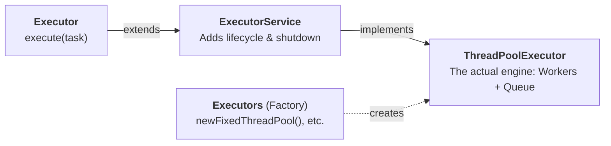
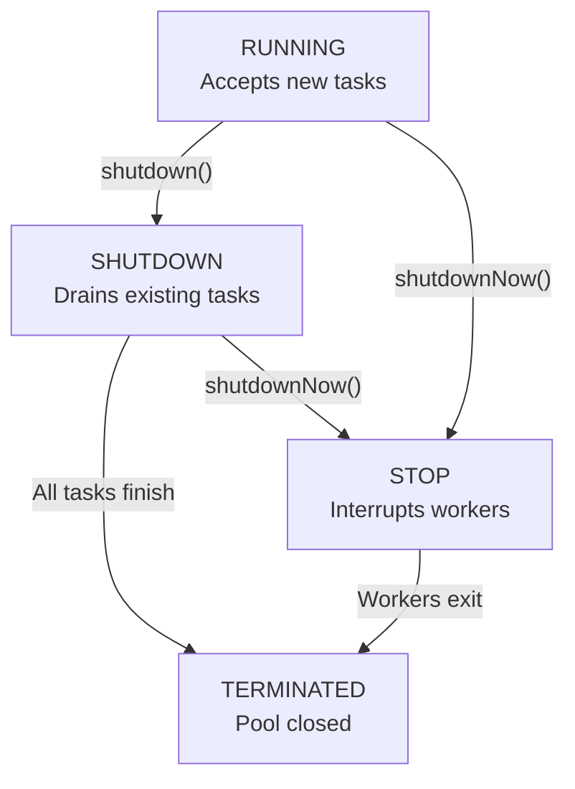

# Executors Framework & Thread Pools

The **Executor Framework** (introduced in Java 5 under `java.util.concurrent`) provides a high-level abstraction for asynchronous task execution. It decouples the definition of a task (`Runnable`) from the mechanics of thread creation, scheduling, and lifecycle management.

---

## 1. Why Use the Executor Framework?

In introductory Java, concurrent tasks are often launched with raw threads:

```java
new Thread(new OrderTask()).start();
```

While simple for small scripts, using raw threads in production applications causes severe problems:

### The Problems with Raw Threads

| Issue | Raw `Thread` Problem | Executor Framework Solution |
| :--- | :--- | :--- |
| **High Creation Overhead** | Allocates ~1MB stack memory and creates an OS kernel thread each time. | **Worker Thread Reuse**: A pool keeps worker threads alive to process thousands of tasks. |
| **Unbounded Resource Exhaustion** | 10,000 concurrent requests spawn 10,000 OS threads, causing `OutOfMemoryError: unable to create new native thread` or severe CPU thrashing. | **Bounded Concurrency**: Fixes the maximum active threads and buffers excess tasks in a queue. |
| **No Separation of Concerns** | The task logic is tightly coupled to OS thread creation and hardware scheduling. | Decouples **what** to execute (`Runnable`) from **how/where** it executes (`Executor`). |
| **Manual Lifecycle Management** | No standard way to gracefully stop, coordinate, or monitor threads on application exit. | Provides standardized shutdown protocols (`shutdown()`, `awaitTermination()`). |

---

## 2. Core Hierarchy



* **`Executor`**: The root interface with just one job: `execute(Runnable)`.
* **`ExecutorService`**: Adds lifecycle control (`shutdown()`, `awaitTermination()`).
* **`ThreadPoolExecutor`**: The actual workhorse class that holds the worker threads and task queue.
* **`Executors`**: A factory utility class with pre-built shortcuts.

---

## 3. How a Thread Pool Works Internally

A thread pool operates on a producer-consumer model using a thread-safe `BlockingQueue`:

```
               [ Task 1 ]  [ Task 2 ]  [ Task 3 ]
                           │
                           ▼
                    [ Task Queue ]  (BlockingQueue)
                    ┌────┬────┬────┐
                    │ T3 │ T2 │ T1 │
                    └────┴────┴────┘
                           │
        ┌──────────────────┼──────────────────┐
        ▼                  ▼                  ▼
  [ Worker 1 ]       [ Worker 2 ]       [ Worker 3 ]  (Reused Threads)
```

1. **Submission**: You submit a `Runnable` task.
2. **Execution**: If an idle worker thread is available, it picks up the task immediately.
3. **Queueing**: If all workers are busy, the task waits in the queue.
4. **Worker Loop**: When a worker finishes a task, it loops back and takes the next one.

### How Does "Thread Reuse" Actually Work?

> **Can you restart a terminated thread in Java?**  
> **No.** Once a `Thread` completes its `run()` method, it enters the `TERMINATED` state. Calling `t.start()` again throws `IllegalThreadStateException`. A dead thread can never be restarted.

**So how does a pool reuse a thread?**  
To reuse a thread, you must **keep it alive inside a continuous loop** that waits for tasks from a queue:

```java
// Conceptual worker loop inside ThreadPoolExecutor
class WorkerThread extends Thread {
    private final BlockingQueue<Runnable> taskQueue;
    private volatile boolean isRunning = true;

    public void run() {
        while (isRunning) {
            try {
                // 1. Thread sleeps here until a task arrives
                Runnable task = taskQueue.take(); 

                // 2. Run the task on THIS SAME thread!
                task.run(); 
            } catch (InterruptedException e) {
                // Handle thread shutdown/interrupt
            }
        }
    }
}
```

If you start this `WorkerThread` **once**, you can push 1,000 tasks into `taskQueue`:
1. The single OS thread executes **Task 1**.
2. Loops back.
3. Executes **Task 2** on the **exact same OS thread**.
4. Loops back and waits for the next task.

---

### Why the Executor Framework Was Created

Before Java 5 (which introduced the Executor framework), this is **exactly what every Java developer had to write by hand**:
* Create a `BlockingQueue` (or hand-roll `synchronized`, `wait()`, and `notify()`).
* Create an array of `WorkerThread` objects with `while (true)` loops.
* Handle what happens if a task throws an uncaught exception (so the worker thread doesn't crash and die).
* Code custom shutdown logic so threads terminate cleanly when the application exits.
* Code idle timeouts so unused threads can be evicted.

Because thousands of developers were writing buggy, hand-rolled versions of this exact pattern, Java 5 introduced `java.util.concurrent`. The **Executor framework** takes this exact worker-loop + queue pattern and packages it into a robust, battle-tested standard library.

---

## 4. Common Thread Pool Types

The `Executors` helper class provides factory methods for standard thread pool configurations:

### 1. `Executors.newFixedThreadPool(int nThreads)`
* **Description**: Maintains exactly `nThreads` active workers.
* **Queue**: Unbounded `LinkedBlockingQueue`.
* **Best Used For**: Workloads where resource consumption must be strictly capped (e.g., database connection pools, fixed-concurrency batch processing).

### 2. `Executors.newSingleThreadExecutor()`
* **Description**: Exactly one worker thread. Guarantees tasks execute sequentially in strict submission (FIFO) order.
* **Self-Healing**: If the single thread terminates unexpectedly due to an uncaught exception, a new replacement thread is created automatically.
* **Best Used For**: Sequential logging, background event dispatching.

### 3. `Executors.newCachedThreadPool()`
* **Configuration**: `corePoolSize = 0`, `maximumPoolSize = Integer.MAX_VALUE`, `keepAliveTime = 60s`.
* **Queue**: `SynchronousQueue` (zero-capacity direct handoff).

#### How It Works Internally: Direct Handoff & Worker Reuse
1. **Idle Worker Pool**: When a worker finishes its task, it does not terminate. It calls `SynchronousQueue.poll(60, TimeUnit.SECONDS)` and blocks, entering an **idle state**.
2. **Task Handoff**: When a new task arrives, the pool checks if any idle worker is waiting at the queue. If yes, the task is handed directly to that worker without creating a new OS thread.
3. **On-Demand Growth**: Only if all existing workers are busy (none are waiting at `poll()`) does the pool allocate a new OS thread.

#### The 60-Second Idle Eviction Policy
* **Resource Cleanup**: If a burst of 100 requests arrives, the pool expands to 100 threads. When traffic subsides, idle workers waiting at `poll(60, SECONDS)` timeout after 60 seconds and terminate cleanly, reclaiming ~100MB of OS stack memory.
* **Workload Sensitivity**:
  * **Short-lived tasks (< 10ms)**: Ideal. Tasks finish so rapidly that a small set of threads is constantly recycled.
  * **Long-running / blocking tasks (e.g., slow HTTP/DB calls)**: Dangerous. Threads remain occupied for seconds; incoming tasks find zero idle workers and force the creation of endless new threads.

#### Why NOT Use `newCachedThreadPool` Everywhere? (Production Pitfalls)
Because `maximumPoolSize` is unbounded (`Integer.MAX_VALUE`), a sudden spike of 10,000 requests against a slow downstream service will attempt to create 10,000 OS threads:
1. **Memory Exhaustion**: $10,000 \times \approx 1\text{MB stack} = 10\text{GB}$ memory consumption, crashing with `OutOfMemoryError: unable to create new native thread`.
2. **CPU Thrashing**: The operating system spends nearly all CPU time performing context switches between thousands of threads rather than executing application code.
3. **Production Recommendation**: Standard services should use a **bounded pool** (`newFixedThreadPool` or a custom `ThreadPoolExecutor` with a bounded queue) to place a strict limit on system resource usage.

#### Does 60-Second Eviction Mean `shutdown()` is Optional?
**No.** `shutdown()` is still strictly required:
* Without `shutdown()`, the JVM process will remain running for at least 60 seconds after the final task completes, making batch scripts or applications appear frozen.
* If any worker thread gets stuck on an unblocked socket or infinite loop, it will never become idle. Without `shutdown()`, the JVM will never terminate.

---

## 5. Thread Pool Lifecycle & Graceful Shutdown

Worker threads created by standard pools are **non-daemon** threads. Unless an executor is explicitly terminated, worker threads keep the JVM process alive indefinitely.

### The Three Termination Methods Explained



#### 1. `shutdown()` — Non-Blocking State Change
* **Behavior**: Asynchronous. It does **not** block the calling thread. It returns immediately (in milliseconds).
* **Action**: Sets internal pool state to `SHUTDOWN`. It refuses all new task submissions (throwing `RejectedExecutionException`), but allows currently running tasks and already-queued tasks to run to completion.
* **Pitfall**: Calling `shutdown()` alone is insufficient if the caller needs to ensure tasks finish before moving on (e.g., before exiting `main()` or closing a database connection).

#### 2. `awaitTermination(long timeout, TimeUnit unit)` — Synchronous Blocking Wait
* **Behavior**: Synchronous. It **blocks the calling thread** until:
  1. All submitted tasks have finished executing, **OR**
  2. The specified timeout expires, **OR**
  3. The calling thread is interrupted.
* **Returns**: `true` if all tasks finished within the window; `false` if the timeout elapsed first.

#### 3. `shutdownNow()` — Emergency Force Cancellation
* **Behavior**: Transitions pool state to `STOP`.
* **Action**:
  1. Drains and returns the list of all waiting tasks that were sitting in the queue without running them.
  2. Sends `Thread.interrupt()` to all actively executing worker threads.
* **Limitation**: If tasks do not check `Thread.currentThread().isInterrupted()` or catch `InterruptedException`, they may continue running until completion.

### The Production 2-Step Shutdown Pattern

```java
ExecutorService executor = Executors.newFixedThreadPool(4);

// Submit workload...
executor.execute(() -> doWork());

// Step 1: Reject new tasks and initiate orderly drain
executor.shutdown();

try {
    // Step 2: Block and wait for existing tasks to finish (e.g., up to 30 seconds)
    if (!executor.awaitTermination(30, TimeUnit.SECONDS)) {
        // Step 3: If tasks stall or exceed timeout, force cancel
        executor.shutdownNow();

        // Optional: Wait briefly for workers to respond to interruption
        if (!executor.awaitTermination(5, TimeUnit.SECONDS)) {
            System.err.println("Thread pool did not terminate completely.");
        }
    }
} catch (InterruptedException e) {
    // Re-cancel if current thread was interrupted while waiting
    executor.shutdownNow();
    Thread.currentThread().interrupt();
}
```

---

## 6. Task Submission: `execute()` vs. `submit()`

`ExecutorService` provides two primary methods to dispatch tasks. Understanding their operational differences is critical for error handling and task coordination:

| Architectural Feature | `execute(Runnable)` | `submit(Callable / Runnable)` |
| :--- | :--- | :--- |
| **Origin** | Base `Executor` interface | `ExecutorService` interface |
| **Return Type** | **`void`** (Fire-and-forget) | **`Future<T>`** (Trackable handle) |
| **Supported Task Types** | `Runnable` only | Both `Callable<T>` and `Runnable` |
| **Result Retrieval** | Cannot return values | Call `future.get()` to retrieve output |
| **Task Cancellation** | Cannot be cancelled once submitted | Call `future.cancel(true)` |
| **Completion Check** | Cannot inspect progress | Call `future.isDone()` |
| **Exception Handling** | **Crashes the worker thread** and logs to `System.err`; pool creates a replacement thread | **Swallowed and captured** inside the `Future`; re-thrown as `ExecutionException` upon `future.get()` |

### The Exception Handling Difference

#### With `execute()`:
An uncaught runtime exception escapes the task, terminates the worker thread, logs to `System.err`, and forces the pool to allocate a brand new worker thread:
```java
pool.execute(() -> {
    throw new RuntimeException("DB Connection Failed"); 
    // Worker thread terminates! Pool must spin up a replacement thread.
});
```

#### With `submit()`:
The executor captures the exception inside the returned `Future`. The worker thread remains alive and returns to the pool. The exception is only surfaced when the caller requests the result:
```java
Future<?> future = pool.submit(() -> {
    throw new RuntimeException("DB Connection Failed");
    // Worker thread survives and returns to pool safely.
});

try {
    future.get(); // Re-throws ExecutionException wrapping RuntimeException!
} catch (ExecutionException e) {
    System.err.println("Caught task exception: " + e.getCause().getMessage());
}
```


---

## 7. Sizing Thread Pools (Rules of Thumb)

Selecting the right thread pool size depends on whether the tasks are **CPU-bound** or **I/O-bound**:

### CPU-Bound Workloads
*(Mathematical computations, video encoding, JSON serialization)*
* CPU cores are continuously busy. Adding more threads than cores increases context-switching overhead without gaining speed.
* **Rule**:
  $$\text{Threads} = N_{\text{CPU}} + 1$$
  *(The $+1$ allows a thread to run if an active thread suffers a page fault or context switch).*

### I/O-Bound Workloads
*(Database queries, REST API calls, file system operations)*
* Threads spend most of their lifetime in `WAITING` or `TIMED_WAITING` states awaiting external responses.
* **Goetz Formula**:
  $$\text{Threads} = N_{\text{CPU}} \times U_{\text{CPU}} \times \left(1 + \frac{W}{C}\right)$$
  Where:
  * $N_{\text{CPU}}$ = Number of available CPU cores (`Runtime.getRuntime().availableProcessors()`)
  * $U_{\text{CPU}}$ = Target CPU utilization ($0 \le U \le 1$)
  * $W/C$ = Ratio of Wait time to Compute time

---

## 8. Do Executors Solve Synchronization, Race Conditions & Deadlocks?

**No.** This is a common misconception when learning concurrency:

> [!IMPORTANT]
> **The Golden Rule**:  
> Executors manage **threads**, but they do **NOT** protect your **shared mutable data**.

Think of an Executor as a **taxi company**:
* It manages the cars (threads) and dispatches waiting passengers (the queue).
* But if two passengers (tasks) arrive at the same destination and fight over the same luggage (shared variable), the taxi company cannot prevent that fight. You still need locks and thread-safe data structures.

### 1. Race Conditions (Still Happen!)
If tasks running on different worker threads update a shared variable, updates are lost:

```java
ExecutorService pool = Executors.newFixedThreadPool(4);

// ❌ RACE CONDITION:
int[] unsafeCount = {0};
for (int i = 0; i < 1000; i++) {
    pool.execute(() -> unsafeCount[0]++); // Corrupted! 4 threads read & write simultaneously
}

// ✅ THREAD-SAFE:
AtomicInteger safeCount = new AtomicInteger(0);
for (int i = 0; i < 1000; i++) {
    pool.execute(() -> safeCount.incrementAndGet()); // Always 1000! Handled by hardware CAS
}
```

**Takeaway**: Thread pools manage **when** tasks run, not **what happens inside** tasks. You must still use `AtomicInteger`, `synchronized`, or `ReentrantLock` for shared mutable state.


### 2. Deadlocks (Classic + Thread Starvation Deadlock)
* **Classic Lock Inversion**: If Task 1 holds Lock A and waits for Lock B, while Task 2 holds Lock B and waits for Lock A, they deadlock on worker threads just as they would on raw threads.
* **Thread Starvation Deadlock (Unique to Pools)**: If a task running on a pool worker submits a subtask to the *same* pool and blocks waiting for the result, but all pool workers are occupied, the subtask can never run. Both parent and child become permanently stuck.

### 3. When Do You Need Synchronization with Executors?

| Scenario | Synchronization Needed? | Why? |
| :--- | :---: | :--- |
| **Independent Tasks** (e.g., sending separate emails) | **NO** | No shared state between tasks. |
| **Shared Mutable Data** (e.g., shared counter, list, map) | **YES** | Worker threads run concurrently and will corrupt data. |
| **`newSingleThreadExecutor()`** | **NO (mostly)** | Only 1 worker thread runs tasks one-by-one in strict FIFO sequence. |

---

## 9. Runnable Code Demonstrations

All executable demonstrations are located in `src/com/practice/multithreading/executor/`:

1. **[BasicThreadPoolDemo.java](../src/com/practice/multithreading/executor/BasicThreadPoolDemo.java)**:
   Demonstrates worker thread reuse, queueing behavior, and the 2-step shutdown protocol.
2. **[ThreadPoolTypesDemo.java](../src/com/practice/multithreading/executor/ThreadPoolTypesDemo.java)**:
   Side-by-side comparison of `SingleThreadExecutor`, `FixedThreadPool`, and `CachedThreadPool`.
3. **[FoodOrderProcessorExecutorDemo.java](../src/com/practice/multithreading/executor/FoodOrderProcessorExecutorDemo.java)**:
   Refactoring the raw `Thread.join()` pattern into a modern `ExecutorService` workflow.
4. **[ThreadPoolRaceConditionDemo.java](../src/com/practice/multithreading/executor/ThreadPoolRaceConditionDemo.java)**:
   Proves that thread pools do not prevent race conditions; demonstrates resolving it with `AtomicInteger`.
5. **[ThreadPoolDeadlockDemo.java](../src/com/practice/multithreading/executor/ThreadPoolDeadlockDemo.java)**:
   Demonstrates Thread Starvation Deadlock when tasks wait on child tasks in a saturated pool.

